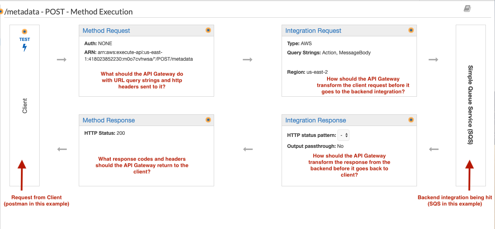
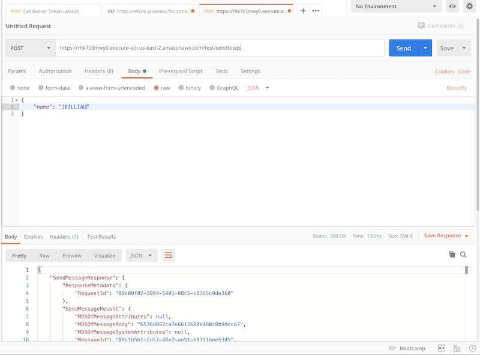

# ECS LAB

This will create an ECS service that runs your custom container in Fargate.

### Upload your local docker image to Elastic Container Registry (ECR)

Navigate to this link first to configure your AWS CLI with the proper credentials:

https://confluence/display/~JBilliau/AWS+Class

Once done, copy and paste the following commands in your terminal window:

1. aws ecr get-login --no-include-email --region us-east-2 --no-verify-ssl

If the above command fails with an invalid security token, open your credentials file in a text editor (probably C:\Users\yourname\.aws\credentials) and delete the line starting with aws_session_token, then run the command again.

2. Take outputted "docker login" command, copy and paste it and run it)

3. docker tag **YOURNAME:YOURVERSION** 418023852230.dkr.ecr.us-east-2.amazonaws.com/training-ecr:**YOURNAME**

4. docker push 418023852230.dkr.ecr.us-east-2.amazonaws.com/training-ecr:**YOURNAME**

### Create ECS Task Definition
This is the blueprint for your application, the ECS equivalent of the docker compose file. It controls what image to run, how many resources to grant, environment variables, logging, etc.

1. Login to awsconsole and navigate to the ECS console. Click **Task Definitions**.
2. Click **Create new Task Definition**. On the next screen, click **FARGATE** and then next step.
3. For *Task Definition Name*, put in your first initial and last name.
4. For *Task Role*, select "None".
5. For *Task Execution Role*, make sure it's set to "ecsTaskExecutionRole*. For *Task Size*, select **1GB** for Task Memory, **.5 vCPU** for Task CPU.
6. Scroll down and click **Add Container**.
    * For *Container name*, put in your first initial, last name again.
    * for *Image*, put in the link to your ECR image you uploaded:
    * For *Memory limits*, put in **128**.
    * For *Port mappings*, put in **80** for the "container port".
    * Click **Add** in the bottom right.
    * Scroll all the way down and click **Create**. If successful, click **View Task Definition** to go back to the main console area.

### Create ECS Service
Amazon ECS allows you to run and maintain a specified number of instances of a task definition simultaneously in an Amazon ECS cluster. This is called a service. This controls how many containers to run, scaling policies, networking configuration, etc.

1. Click **Clusters**, then **click test-ecscluster-418023852230-us-east-2**.
2. Under the *Services* tab, click **Create**.
    * For *Launch Type*, click **FARGATE**.
    * For *Task Definition*, select your name for the "Family", then *1 (latest)* for the "revision".
    * For *Service name*, put in your first initial, last name.
    * For *Number of Tasks*, put in 1. Scroll all the way down, click **Next Step**.
    * Uncheck *Enable service discovery integration*, then scroll up a bit to the *VPC and security groups* section.
    * For *Cluster VPC*, select **vpc-08850982ee9a0f0a1**. For *Subnets*, select one with the word **PUBLIC** in the name, doesnt matter which. Ensure *Auto-assign public IP* is enabled.
    * Scroll all the way down and click **Next Step** twice, then **Create Service**.
    * You will be taken to the status screen for your service. Hit refresh on the right hand side until you see a task appear and go to the *last status* of **RUNNING**. This means
    your container is running successfully. Click the **Task** link (long guuid-like number). Under the *Network* section, you will see a **Public IP**. Copy and paste it into your browser
    and you should see your container's web page!

# Lambda LAB

This will create a S3 bucket which, when a file is dropped there, will trigger a lambda that will read what type of file it is and output the metadata to Cloudwatch.

## Steps

1.) Go to S3 console and click “Create Bucket”. Name it 99999-YOURNAME, substituting in your first initial, last name. Click Create.

2.) Go to Lambda console and create a new function. Create from a blueprint and search for “s3”. Select the “s3-get-object-python” blueprint. Click “Configure”.

3.) Fill out as such:

- Name your function 99999-YOURNAME, like the s3 bucket above.
- Set EXECUTION ROLE to “Create a new role with basic Lambda Permissions”.
- Scroll down a bit and select your bucket create in step 1.
- Click the checkbox for "Enable Trigger".
- Hit "Create Function"

4.) Go to your bucket and look at the properties tab. Scroll down to EVENTS....notice how it's now associated with the lambda function you create in step 2; that was done via the "Enable Trigger" checkbox. Go ahead and upload a file, doesn't matter what.

5.) Go to the Cloudwatch console and click "Logs" on the left hand side. In the filter box, look for "/aws/lambda/99999-YOURNAME".

6.) Once you find it, click it then click "Search Log Group". Did the lambda trigger successfully output the type of file we uploaded? Why or why not?

# API Gateway LAB

This will create an API Gateway that sits in front of an SQS queue, allowing us to hit an authenticated endpoint and send a JSON body that will end up in a queue.

1.) Go to the SQS console and create a new queue. Call it your 999999-YOURNAME, where YOURNAME is your first initial,last name. Click **Quick-create queue**

2.) Navigate to https://git.rockfin.com/training-iac/training-starter-kit/blob/master/docs/AWS/swagger.json. Copy the contents of that file to your clipboard.

2.) GO to the API Gateway console in AWS. Navigate to the "REST API" box and click **Import**.

3.) Select *Import from Swagger or OpenAPI 3*, then paste in the swagger you copied in step 1. Replace *YOURNAME* with your first initial, last name in the 2 spots where the placeholder is (line 5, 7 and line 21). Click **Import**.

4.) Click on the *POST* method under the */metadata* resource. Now how you're presented with 6 boxes, 4 in the middle surround by long ones on the left and right. This shows the basic process for how an API Gateway functions. See screenshot below:

  </img>

5.) Now that you understand the basic flow, let's deploy this and get it working! On the left-top side of the screen, click *Actions* and then **Deploy API**. For deployment stage, select "[New Stage]" and for Stage Name, put in *test*. Click **Deploy**.

6.) Note you now have an invoke url....your API Gateway is officially deployed and able to be used. Then do the following steps:
   * Go into Postman and paste that URL into a new tab, appending "/sendtosqs" to the URL.
   * Change your method to POST.
   * Click "body" underneath the URL and paste in the following json, replacing YOURNAME.
        {
    "name": "YOURNAME"
}
   * Change "text" to application/json.

It should look like this:

  </img>

7.) Hit **Send** in Postman and see if you get a 200 back. If so, go check your queue by right clicking on it and clicking "View/Delete Messages". Once the window opens, click "start polling for messages". Is your message there?