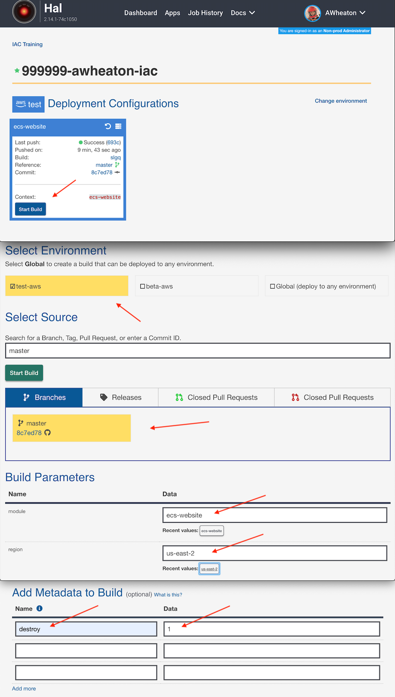
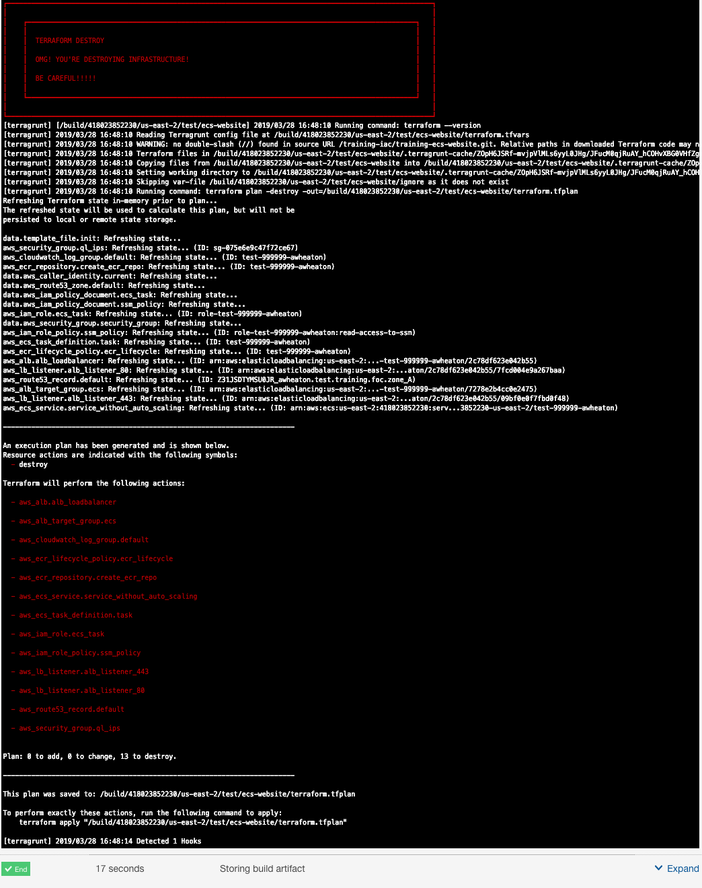
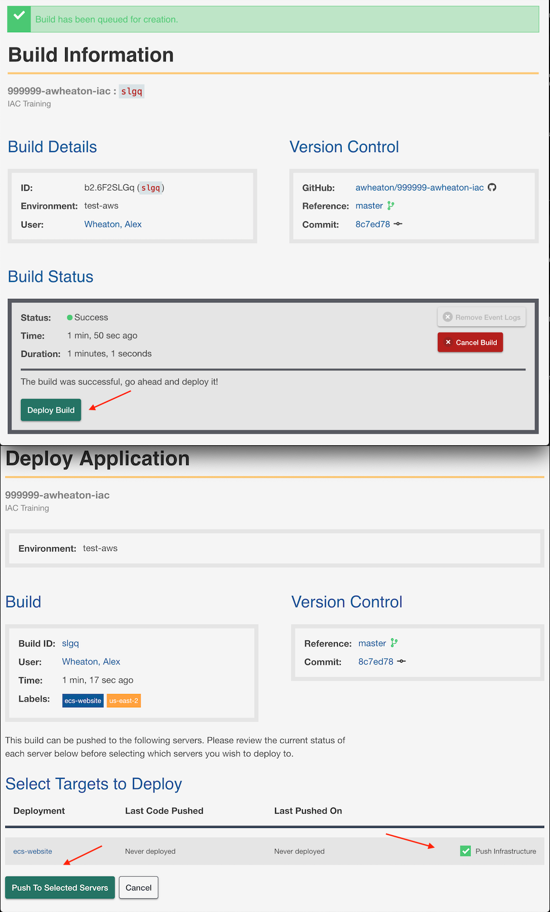
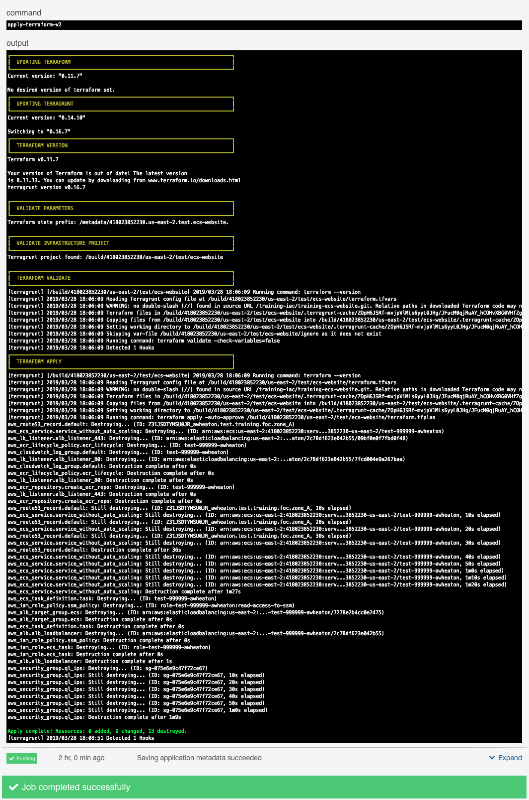

# Terraform Lab Cleanup

## Destroy Infrastructure

### HAL Build 

To destroy, we will do another HAL build (see below), go to Application Dashboard > Start New Build. Select your branch, **fill out the module and region parameters** (ecs-website and us-east-2, for our example).  

**Don't Start Build Yet**. 

For a destroy we need to add the "destroy" key to the metadata field at the bottom of the page, with a value "1" (See Image Below).  Now we can start the build.

### Review Output

Review the output and verify that the resources you want destroyed are listed in the ouput as seen below.

### Push Build (Destroy)

Once verified, go ahead and destroy.  The deploy process for the destroy is the same as an apply, we simply push the build.

### Success

This is what a successful Destroy should look like for this lab:

### Now repeat the process for BETA